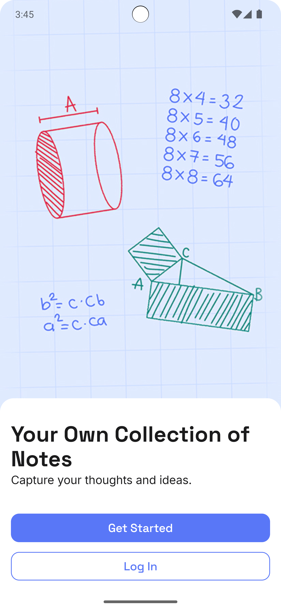
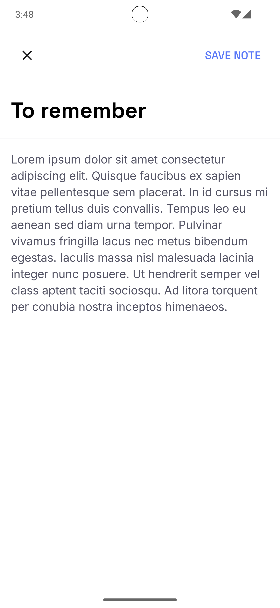
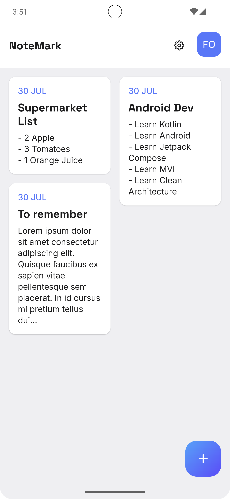

# NoteMark

A modern mobile note-taking application developed for Mobile Dev Campus that allows users to capture, organize, and manage their thoughts and ideas seamlessly. Built with a clean, intuitive interface for creating and editing notes with automatic synchronization capabilities.

## Features

- **Clean Note Creation**: Simple and intuitive interface for writing notes
- **Organized Collection**: View all your notes in a well-organized grid layout
- **Auto-save**: Automatic saving of notes as you type
- **User Account Integration**: Secure login and personalized note collections
- **Cross-device Sync**: Keep your notes synchronized across devices
- **Flexible Note Types**: Support for various note formats including lists, text notes, and more

## Screenshots

<div style="text-align: center;">

### Welcome Screen


*Get started with your personal note collection*

### Note Editor


*Clean, distraction-free writing experience*

### Notes Dashboard


*Organized view of all your notes with timestamps*

</div>

## Configuration

You need to specify the api.url environment variable for the api and valid email with active subscription.

In local.properties:
```
api.url=https://api-url/api
user.email=your-active@email.com
```

## Author

[Fomaxtro](https://github.com/fomaxtro)

## Licence

Licence under the [MIT License](./LICENCE)